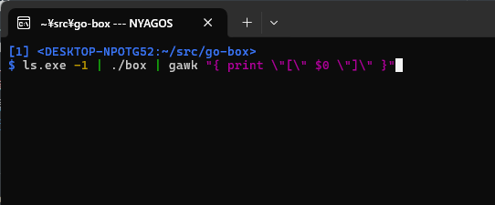

Go-Box - Interactive item selector
==================================

box - Executable
----------------

- `box` reads choices from STDIN, 
- On `box`, the user selects one by cursor (HJKL , C-n &amp; C-p &amp; C-f &amp; C-b)
- `box` outputs chosen one to STDOUT.



go-box - golang package
-----------------------

```examples/yesno.go
package main

import (
    "os"

    "github.com/nyaosorg/go-box/v2"
)

func main() {
    println("Are you sure ?")
    choose, err := box.SelectString([]string{"Yes", "No"}, false, os.Stderr)
    if err != nil {
        println(err.Error())
        os.Exit(1)
    }
    println()
    if len(choose) >= 1 {
        println("You selected ->", choose[0])
    } else {
        println("You did not select any items")
    }
}
```
