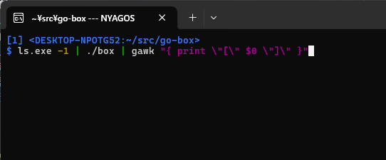

Go-Box - Interactive item selector
==================================

<!-- badges.cmd | -->
[](https://github.com/nyaosorg/go-box/v3/actions/workflows/go.yml)
[](https://github.com/nyaosorg/go-box/v3/blob/master/LICENSE)
[](https://pkg.go.dev/github.com/nyaosorg/go-box/v3)
<!-- -->

> **Note:** This is the documentation for **go-box v3**.  
> If your code still imports `github.com/nyaosorg/go-box` or `/v2`,  
> please update the import path to `github.com/nyaosorg/go-box/v3`.

box - Executable
----------------

`box` is a command-line program built with the **go-box** library.  
It reads a list of items from STDIN and lets the user select one interactively.




### Install

Download the binary package from [Releases](https://github.com/nyaosorg/go-box/releases) and extract the executable.

#### Use "go install"

```
go install github.com/nyaosorg/go-box/v3/cmd/box@latest
```

#### Use "scoop-installer"

```
scoop install https://raw.githubusercontent.com/nyaosorg/go-box/master/box.json
```

or

```
scoop bucket add hymkor https://github.com/hymkor/scoop-bucket
scoop install box
```

go-box - golang package
-----------------------

```examples/yesno.go
package main

import (
    "os"

    "github.com/nyaosorg/go-box/v3"
)

func main() {
    println("Are you sure ?")
    choose, err := box.SelectString([]string{"Yes", "No"}, false, os.Stderr)
    if err != nil {
        println(err.Error())
        os.Exit(1)
    }
    println()
    if len(choose) >= 1 {
        println("You selected ->", choose[0])
    } else {
        println("You did not select any items")
    }
}
```

Release notes
-------------

- [English](release_note.md)
- [Japanese](release_note_ja.md)
