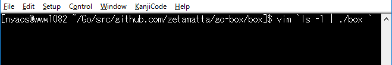
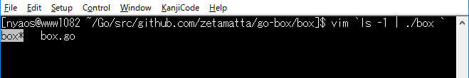
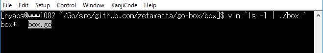
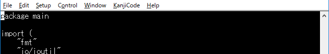

box
===

Read lines from STDIN, Select one by cursor(HJKL) & Output chosen one to STDOUT.

(1) Select file to edit with vim

(2) Start **`./box`** to choose one of files.

(3) Select `box.go`

(4) Type `Enter` to start vim

